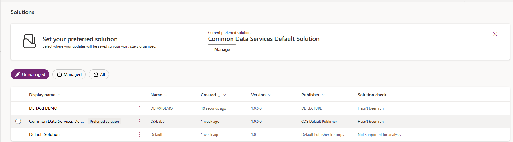
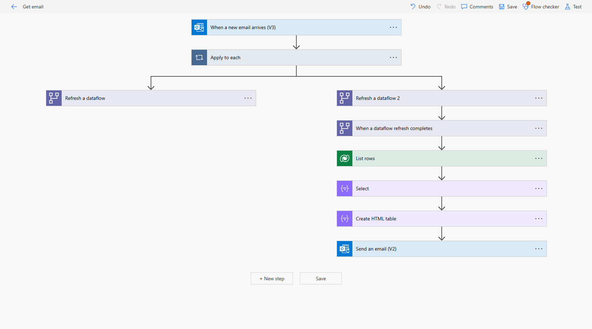

# Weather Data Pipeline with Airflow

## Project Description
This project demonstrates an ETL pipeline built using **Apache Airflow** to extract weather data from the OpenWeather API, transform it, and load it into a **PostgreSQL** database. The pipeline ensures modularity and reliability through the following steps:
1. **API Readiness Check**: Confirms API availability.
2. **Data Extraction**: Fetches weather data from the OpenWeather API for a given city.
3. **Data Transformation**: Converts raw API data (e.g., temperature in Kelvin) into a usable format.
4. **Data Loading**: Inserts transformed data into a PostgreSQL database with an appropriate schema.


### Airflow DAG
The Airflow DAG implements the following tasks:
- **API Readiness Check**: Uses an `HttpSensor` to check the availability of the OpenWeather API.
- **Extract Weather Data**: Uses a PythonOperator to fetch weather data via API.
- **Transform Weather Data**: Transforms API responses (e.g., temperature conversion) and prepares data for insertion.
- **Load Weather Data**: Inserts transformed data into a PostgreSQL table with a well-defined schema.

#### Code:
Find the Airflow DAG code [here](dags/lab5.py).

###  Database Schema
The PostgreSQL schema is defined as follows:
- **Schema**: `labs`
- **Table**: `weather`
- **Columns**:
  - `temp_fahrenheit`: `FLOAT`
  - `pressure`: `INT`
  - `humidity`: `INT`
  - `timestamp`: `TIMESTAMP`
  - `city`: `VARCHAR(255)`

#### Query to Create the schema:
```sql
CREATE SCHEMA IF NOT EXISTS labs;

CREATE TABLE IF NOT EXISTS labs.weather (
    temp_fahrenheit FLOAT,
    pressure INT,
    humidity INT,
    timestamp TIMESTAMP,
    city VARCHAR(255)
);
```

### Database Image
- Screenshot of records in the database.

**Data Record:**


### Airflow Logs
Provide screenshots of DAG performance and logs.

**DAG Overview:**


**Logs**
- Logs for checking API readiness.


- Logs for fetching the data


- Logs for transforming the data


- Logs for loading the data

### Architecture Diagram
A visual representation of the architecture implemented in this project.

**Diagram Description:**
- **Input Source**: OpenWeather API.
- **ETL Workflow**: Managed by Airflow.
- **Database**: PostgreSQL for storing transformed weather data.


# POWER APPS
- Creating a solution `DE Taxi Demo` within an environment.

 

### Power Automate flow within the DE Taxi Demo solution.
 **Email Processing:**
 - **Trigger** the flow when an email is received.
 - An email that has **YellowTaxi** in the Body or Subject.
 - Download the attachment and save it to a folder in OneDrive named DE PowerAutomate.


 **Data Transformation and Load** 
- Load the data from the saved OneDrive file into Power Query.
- Perform the following transformations:
  - Remove unnecessary columns.
  - Filter out rows where the drop-off coordinate is 0.
  - Parse coordinates as text to ensure compatibility with Dataverse
  - Storage in Dataverse

  

  

**Data Profiling** 
- 

- 


- 


# DATA FLOW
- 


#### Images of the Power Apps.
- 


- 